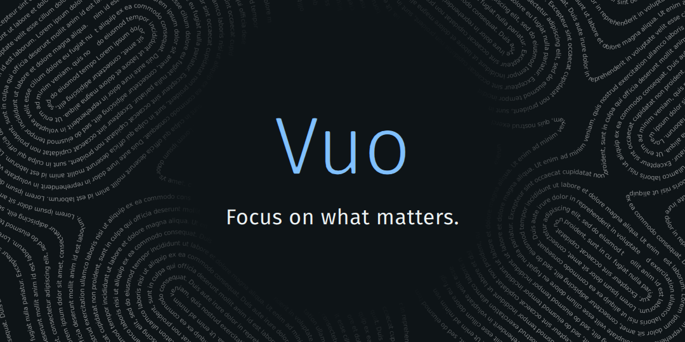

# Vuo 



[](https://sonarcloud.io/summary/new_code?id=muhnschein_vuo)[](https://sonarcloud.io/summary/new_code?id=muhnschein_vuo)[](https://sonarcloud.io/summary/new_code?id=muhnschein_vuo)[](https://sonarcloud.io/summary/new_code?id=muhnschein_vuo)

> 🤖 **Vibe-coded:** Much of this project was developed using AI. If that
> provenance troubles you, use something else. That being said, all the heavy
> lifting is done by your existing  Miniflux instance.
>
> 📱 **Modern SailfishOS-only:** Vuo currently targets the 
> Jolla Phone 2026 and nothing else. No effort is made to accommodate older
> targets. [Buy a Jolla Phone 2026](https://commerce.jolla.com/) and support
> European-made alternatives. 👊🇪🇺🔥

## Overview

Vuo is a Silica/QML feed reader that syncs against an existing, self-hosted
Miniflux instance over Miniflux's own REST API.

The goal is not to built a feed reader, but to build an Sailfish OS UI for
an existing (excellent) feed-reading server. Fetching, parsing, sanitisation, 
deduplication, full-text extraction, and scheduling all stay on the server. 

## Architecture

| Crate | Qt dependency | What it is |
| --- | --- | --- |
| `vuo-core` | no | Miniflux REST client, SQLite mirror, sync engine, HTML→block transform |
| `vuo-shim` | yes | `qmetaobject-rs` adapters exposing the core to QML as `QObject`s and list models |
| `qml/` | yes | Silica UI |

Two properties fall out of the layering and are worth stating explicitly:

- **The local SQLite mirror is the single source of truth for the UI.** The UI
  never waits on the network. Sync writes to SQLite; models observe SQLite.
- **Local mutations go through an outbox.** Marking read, starring and
  mark-all-read are written locally and enqueued, then replayed against the
  server in batches. Replay is idempotent and survives being killed mid-flight.

See [`docs/scope.md`](docs/scope.md) for the full scope and non-goals.

## Building

`vuo-core` builds and tests on a plain host toolchain — no Qt, no Sailfish SDK:

```sh
make check      # fmt, clippy, tests, qmllint, packaging checks — exactly what CI runs
make msrv       # re-check against the Sailfish Rust floor
```

The governing rule: **`make check` runs exactly what CI runs, from a clean
checkout, with no phone, no server account, and no network.** Anything that
cannot be verified under those conditions is either badly layered or belongs
behind an explicit opt-in gate.

Device RPMs are built with the Sailfish SDK (Docker build engine — the
VirtualBox engine cannot build Rust):

```sh
scripts/build-rpm.sh aarch64
```

## Licence

Licensed GPLv3+, see the [`LICENSE file`](LICENSE) for details.

Copyright © Vuo contributors.
